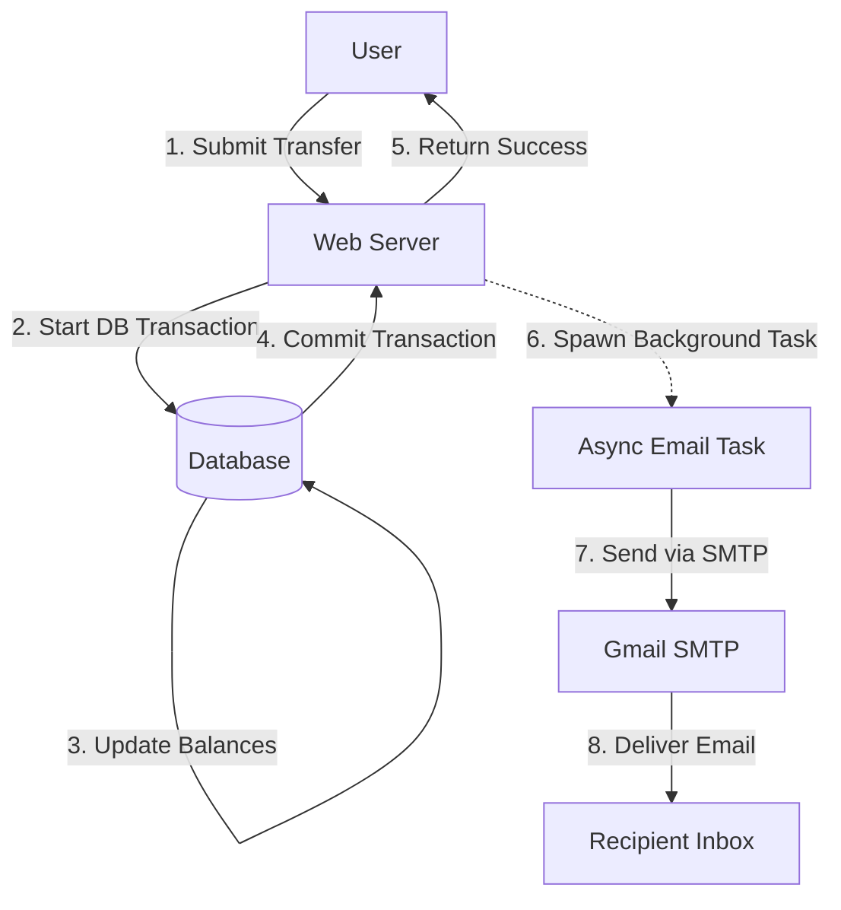

# 📧 Email Notification Service - Implementation Guide

## 🎯 Overview
This document explains the **Email Notification System** we built for the Fintech App. It automatically sends an email to the recipient whenever a money transfer is successful.

The system is designed to be **asynchronous** (non-blocking), meaning the user gets an instant "Success" response without waiting for the email to be sent.

---

## 🏗️ Architecture & Data Flow

### How It Works
1. **User Request**: User submits a transfer form (e.g., send $50 to Alice).
2. **Database Transaction**: The app updates the sender and receiver balances in the database securely.
3. **Commit**: The transaction is committed (saved) to the database. The money is now officially moved.
4. **Async Email Task**: *After* the commit, we spawn a background task to send the email.
5. **SMTP Delivery**: The app connects to Gmail's SMTP server and sends the email.



---

## 💻 Code Implementation Details

Here is exactly what we changed in the codebase to make this work:

### 1. New Dependency: `lettre`
We added the `lettre` crate to `Cargo.toml`. This is the standard Rust library for sending emails.
- **Why**: It supports async SMTP, TLS encryption, and easy email building.

### 2. New Service: `EmailService`
**File**: `src/services/email_service.rs`

We created a reusable struct to handle all email logic.
- **Fields**: It holds the SMTP connection pool (`mailer`) and the sender address (`from`).
- **Method `send_transfer_success`**:
  - Takes a recipient email and amount.
  - Formats a message: *"You have successfully received ${amount}..."*
  - Sends it using the stored connection.

### 3. Usage in `WalletService`
**File**: `src/services/wallet_service.rs`

This is where the business logic lives.
- **Modified `transfer` function**: We added an `email_service` parameter.
- **Critical Logic**:
  ```rust
  // 1. Commit the transaction first (Safety First!)
  tx.commit().await?;

  // 2. Send email in the background (Performance!)
  let email_service = email_service.clone();
  let recipient = recipient_email.to_string();
  tokio::spawn(async move {
      email_service.send_transfer_success(&recipient, amount).await;
  });
  ```
- **Why `tokio::spawn`?** This creates a separate "green thread". The web request finishes immediately, while this thread takes a few seconds to talk to Gmail.

### 4. Integration in `main.rs` & `AppState`
**File**: `src/main.rs`, `src/routes/auth_routes.rs`

- We added `email_service` to `AppState` so it's available to all routes.
- In `main.rs`, we initialize it using configuration credentials.

### 5. Configuration via `.env`
**File**: `.env`, `src/config.rs`

We added these environment variables to keep credentials safe:
- `SMTP_HOST`: `smtp.gmail.com`
- `SMTP_PORT`: `587`
- `SMTP_USER`: Your Gmail address.
- `SMTP_PASSWORD`: A **Gmail App Password** (app-specific, revokable, secure).

---

## 🔒 Security Decisions

1. **App Passwords**: We use a Google App Password, not your real password. This is much safer as it can be revoked at any time and doesn't grant full account access.
2. **Environment Variables**: Credentials are never hardcoded in Rust files; they are loaded from `.env` which is ignored by Git.
3. **TLS Encryption**: Communication with Gmail is encrypted using STARTTLS.

---

## 🧪 How to Test/Verify

1. **Setup**: Ensure your `.env` has the correct `SMTP_PASSWORD`.
2. **Run**: `cargo run`
3. **Action**: logic in as a user, go to "Transfer", and send money to another email address you own.
4. **Verification**:
   - The UI should say "Transfer Successful!" immediately.
   - Check the **Server Logs**: You should see `✅ Email sent successfully to...`.
   - Check the **Inbox**: The email should arrive within a few seconds.

---

## ❓ FAQ for Explanation

**Q: What happens if the email fails to send?**
A: The transfer **still succeeds**. We prioritized the financial transaction (database commit). The email is just a notification. If it fails (e.g., bad internet), the user still sees "Success" and the money is moved.

**Q: Why is it "async"?**
A: Sending an email takes time (1-3 seconds). If we didn't use `tokio::spawn`, the user would have to stare at a loading spinner for that long. By making it async, the UI is snappy.

**Q: Can we send to any email?**
A: Yes! Unlike the "Resend" sandbox we tried earlier, Gmail SMTP lets you send to any valid email address.
