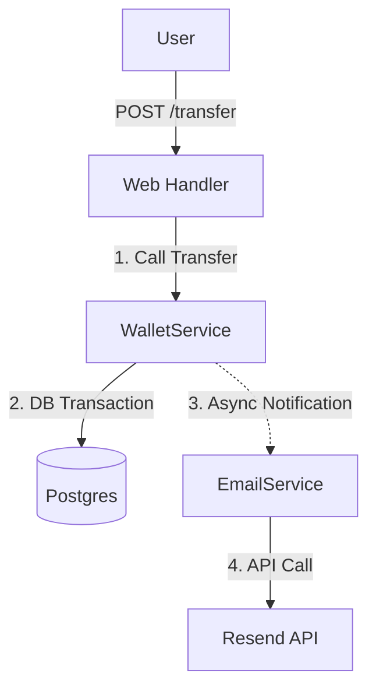

# 📧 Email Notification Plan (Resend Edition)

We are switching to **Resend** for sending emails. It's a modern API-based email service, which simplifies our configuration compared to SMTP.

## 1. The Architecture


## 2. Step-by-Step Implementation

### Step 1: Configuration
- **Dependency**: Add `resend-rs` to `Cargo.toml`.
- **Environment**: Add `RESEND_API_KEY` to `.env`.
- **Config**: Update `config.rs` to load the API key.

### Step 2: The Email Service (`src/services/email_service.rs`)
We will wrap the `Resend` client in our own service for clean testing and usage.

```rust
use resend_rs::{Resend, types::CreateEmailBaseOptions};

#[derive(Clone)]
pub struct EmailService {
    client: Resend,
}

impl EmailService {
    pub fn new(api_key: String) -> Self {
        Self { client: Resend::new(api_key) }
    }

    pub async fn send_transfer_success(&self, to: &str, amount: Decimal) {
        let from = "Acme <onboarding@resend.dev>"; // Sandbox sender
        let subject = "Transfer Successful";
        let body = format!("<strong>You successfully sent ${}</strong>", amount);

        let email = CreateEmailBaseOptions::new(from, to, subject)
            .with_html(&body);

        let _ = self.client.emails.send(email).await;
    }
}
```

### Step 3: Integration (`src/main.rs`)
- Initialize `EmailService` with the API key.
- Add it to `AppState`.

### Step 4: Logic Integration (`src/services/wallet_service.rs`)
- In `transfer`, call `tokio::spawn(async move { email_service.send_transfer_success(...) })`.

## PRE-REQUISITES (User Action Required)
1.  **Sign up** at Resend.com.
2.  **Create API Key**.
3.  **Verify Domain** (optional for testing, can use `onboarding@resend.dev` to your own email).
