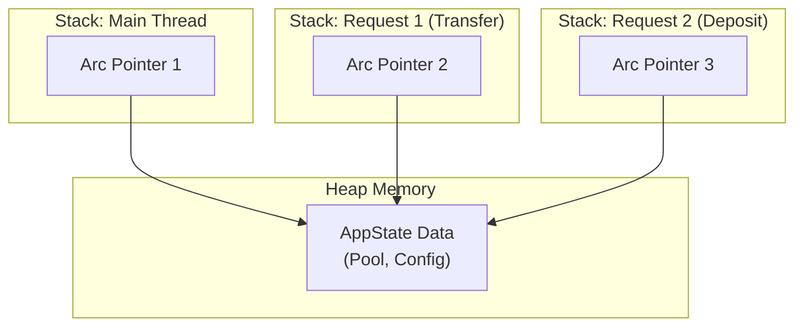
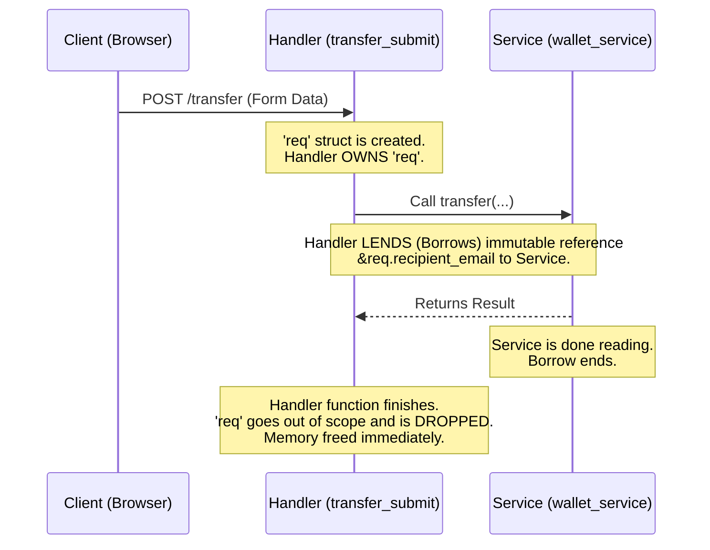

# Visualizing Rust Ownership & Borrowing
## Case Study: The Transfer Feature

To understand how Rust manages memory safely without a garbage collector, let's visualize the "Transfer Money" flow.

### 1. The `AppState` (Shared Ownership with `Arc`)

When the server starts, we create **one** `AppState`. But every request needs access to it.
- **Problem**: Who owns the `AppState`? If `main` owns it, how do handlers use it concurrently?
- **Solution**: `Arc` (Atomic Reference Counting).



**Code Visualization:**
```rust
// main.rs
let state = AppState { ... }; // Created once

// When a request comes in, axum CLONES the Arc, not the data!
// This is cheap (just incrementing a counter).
let state_for_handler = state.clone(); 
```

---

### 2. Moving Ownership in `transfer` Handler

Let's look at the `transfer_submit` handler in `web.rs`.

```rust
pub async fn transfer_submit(
    AuthUser(user_id): AuthUser,
    State(state): State<AppState>,
    Form(req): Form<TransferRequest>, // <--- Ownership of 'req' MOVES here
) -> Result<...> {
    // We pass references (&) to the service because the service doesn't need to OWN the data,
    // it just needs to READ it.
    wallet_service::transfer(
        &state.pool,         // Borrow the pool
        user_id,             // Copy (Uuid is Copy)
        &req.recipient_email,// Borrow the email string
        req.amount           // Copy (Decimal is Copy)
    ).await?;
    
    // 'req' is dropped here when the function ends.
    // 'state' (the Arc) is dropped here, decrementing the reference count.
}
```

**Diagram: Ownership Transfer**



---

### 3. The `Mutex` (Interactive Mutability)

If we implement the **Token Blacklist** we discussed, we need to mutate shared data.

```mermaid
graph TD
    subgraph Arc
        M[Mutex]
    end
    
    subgraph Mutex
        D["Data: HashSet<String>"]
    end
    
    T1[Thread 1] -- "lock()" --> M
    T2[Thread 2] -- "lock()" --> M
    
    Note right of M: Only ONE thread can get the lock.<br/>Others must wait.
```

1.  **Thread 1** calls `lock()`. It gets a `MutexGuard`.
2.  **Thread 1** can now modify the `HashSet` inside.
3.  **Thread 2** calls `lock()`. It is **blocked** (asleep) until...
4.  **Thread 1** drops the `MutexGuard` (unlocks).
5.  **Thread 2** wakes up, gets the lock, and proceeds.

This guarantees no data races!

---

### Key Takeaways for our App

1.  **`Arc<T>`**: "I want multiple parts of my app to own this data." (Used for `AppState`).
2.  **`Mutex<T>`**: "I want to change this data safely across threads." (Used for mutable shared state like blacklist).
3.  **Borrowing (`&T`)**: "I want to let this function look at my data, but not consume/delete it." (Used in service calls).
4.  **Moving (`T`)**: "I am done with this data, you take it." (Used when passing `Form` data into handlers).
