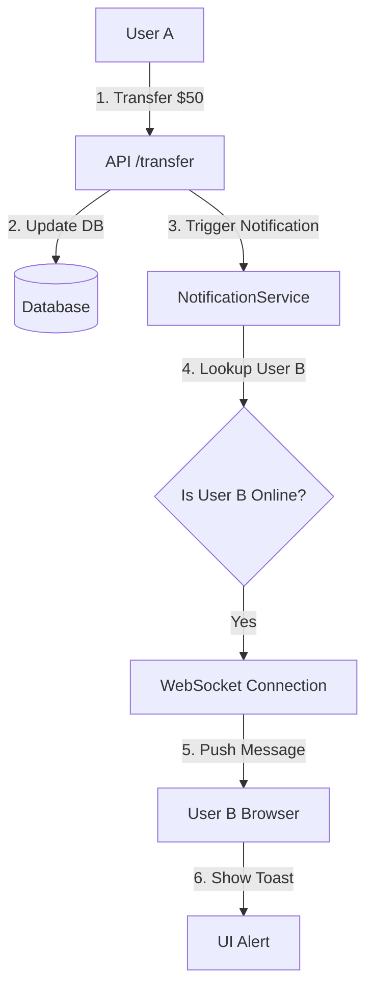

# 📡 Real-Time Notifications (WebSockets) Implementation Plan

## 🎯 Goal
Implement a system to push **instant notifications** to users (e.g., *"You received $50 from Alice!"*) without them needing to refresh the page.

---

## 🏗️ Architecture

We will use **WebSockets** for a persistent connection between the client (browser) and the server (Axum).

### Key Components

1.  **Shared State (`NotificationService`)**
    - A thread-safe map: `Arc<Mutex<HashMap<UserId, UnboundedSender<String>>>>`
    - Stores active connections so we know *who* is online.
    - When User A sends money to User B, we look up User B in this map.

2.  **WebSocket Endpoint (`GET /ws`)**
    - The browser checks for a session cookie.
    - If valid, upgrades the HTTP request to a WebSocket connection.
    - Adds the user's connection to the `NotificationService`.
    - Removes it when they disconnect.

3.  **Frontend (`base.html`)**
    - Simple JavaScript to connect to `ws://localhost:3000/ws`.
    - Displays a "Toast" popup when a message is received.

---

## 📝 Step-by-Step Implementation

### Phase 1: dependencies & Configuration
1.  **[MODIFY] `Cargo.toml`**
    - Enable the `ws` feature for `axum`.

### Phase 2: Backend Logic
2.  **[NEW] `src/services/notification_service.rs`**
    - Create `NotificationService` struct.
    - Implement methods: `add_client()`, `remove_client()`, `send_message()`.

3.  **[MODIFY] `src/routes/auth_routes.rs`**
    - Add `notification_service` to `AppState`.
    - Add the `/ws` route.
    - Initialize the service in `main.rs`.

4.  **[NEW] `src/handlers/ws.rs`**
    - Create the WebSocket handler.
    - Handle the upgrade and connection loop.

### Phase 3: Integration
5.  **[MODIFY] `src/services/wallet_service.rs`**
    - Inject `NotificationService`.
    - Call `notification_service.send_message(...)` inside `transfer()`.

### Phase 4: Frontend
6.  **[MODIFY] `templates/base.html`**
    - Add JavaScript to connect to the WebSocket and show alerts.

---

## 🔄 Data Flow Diagram

